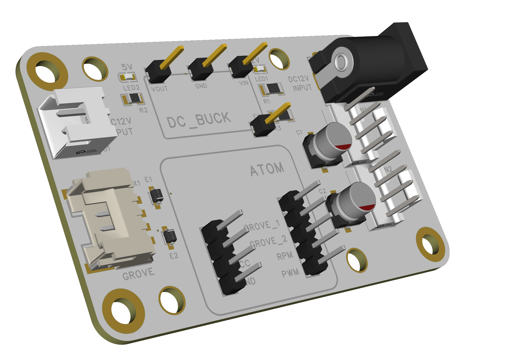

```
 _____ _    _   _ _____ ___  __  __ 
|  ___/ \  | \ | |_   _/ _ \|  \/  |
| |_ / _ \ |  \| | | || | | | |\/| |
|  _/ ___ \| |\  | | || |_| | |  | |
|_|/_/   \_\_| \_| |_| \___/|_|  |_|
|USE M5STACK ATOMS3 CONTROL PWMFANS|
|__________________________________|
```
# 简介
使用嵌入式模块控制 12V PWM 风扇的项目


  
# 支持的嵌入式模块
M5STACK ATOM
> ATOM Lite  
> ATOM Martix  
> ATOM S3  
> ATOM S3-Lite  
> ATOM S3-Echo  
> ATOM S3R  

WAVESHARE RP2040
SeeedStudio XIAO


# 电路



